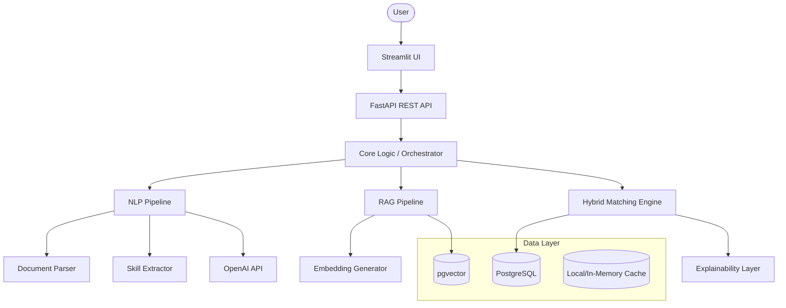
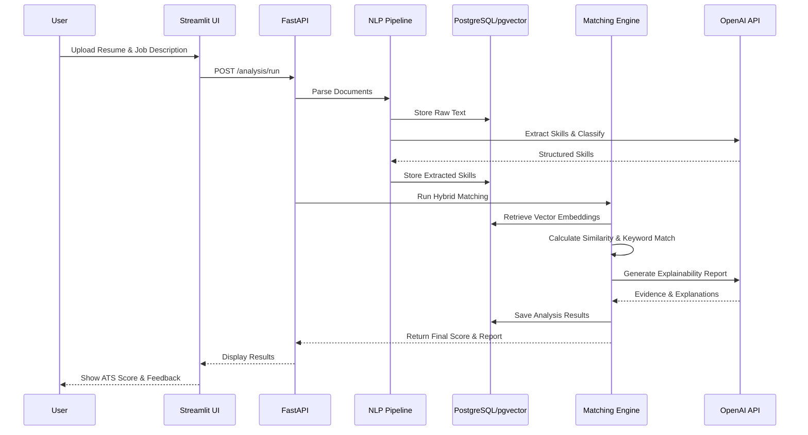

# AI Job Copilot Architecture

## 1. System Overview

The AI Job Copilot is a production-grade ATS Resume Optimization System. It uses a retrieval-augmented generation (RAG) approach to evaluate resumes against job descriptions, providing an explainable scoring mechanism, skill gap analysis, and resume optimization suggestions.

## 2. Architecture Diagram



## 3. Data Flow Diagram



## 4. Folder Structure

```
ai_job_copilot/
├── .github/
│   └── workflows/
│       └── ci_cd.yml
├── docs/
│   ├── architecture.md
│   └── database_schema.md
├── src/
│   ├── api/                 # FastAPI routes and schemas
│   │   ├── routes/
│   │   └── schemas/
│   ├── core/                # Business logic
│   │   ├── config.py
│   │   ├── exceptions.py
│   │   └── logger.py
│   ├── database/            # SQLAlchemy models and migrations
│   │   ├── models.py
│   │   └── session.py
│   ├── nlp/                 # Parsing and extraction
│   │   ├── parser.py
│   │   └── extractor.py
│   ├── rag/                 # Chunking, embeddings, retrieval
│   │   ├── chunker.py
│   │   ├── embedder.py
│   │   └── retriever.py
│   ├── matching/            # Scoring and explainability
│   │   ├── engine.py
│   │   └── explainer.py
│   ├── evaluation/          # Testing framework for AI outputs
│   └── ui/                  # Streamlit application
│       ├── pages/
│       └── app.py
├── tests/
│   ├── unit/
│   └── integration/
├── .env
├── .gitignore
├── requirements.txt
└── README.md
```

## 5. Deployment Architecture

- **Frontend**: Streamlit (can be deployed on Streamlit Community Cloud or AWS EC2/ECS)
- **Backend API**: FastAPI deployed on AWS Lambda (via Mangum) or AWS ECS/AppRunner.
- **Database**: Amazon RDS for PostgreSQL with the `pgvector` extension enabled.
- **AI Services**: OpenAI API for LLM and Embeddings.
- **CI/CD**: GitHub Actions for automated testing and deployment.
