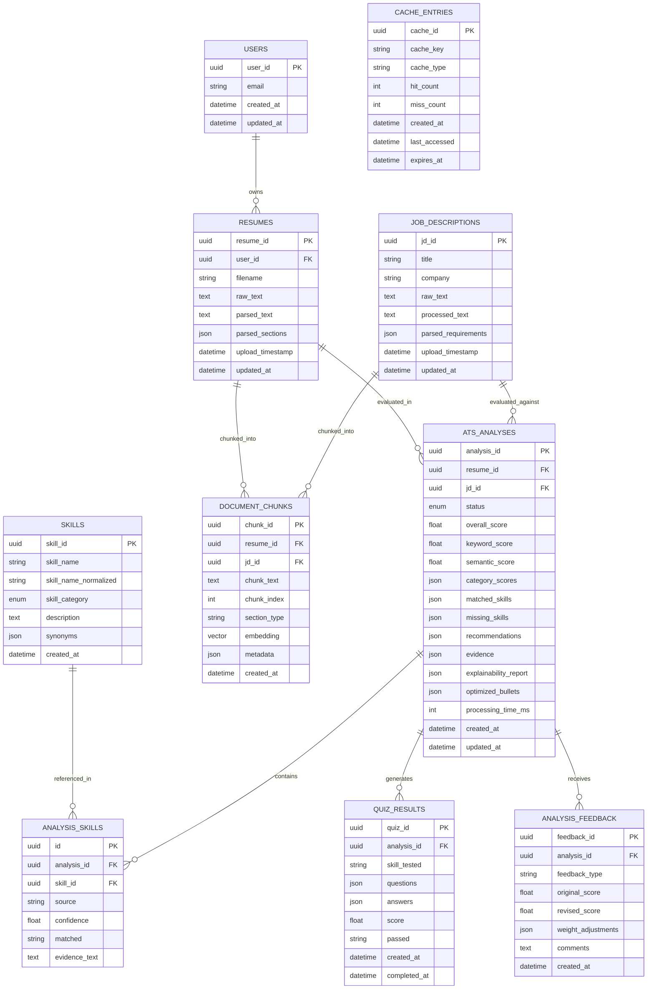

# Database Schema Documentation

## Entity Relationship Diagram

## Indexing Strategy

| Table | Index Name | Columns | Purpose |
|-------|-----------|---------|---------|
| users | idx_users_email | email | Fast user lookup by email |
| resumes | idx_resumes_user_id | user_id | Retrieve all resumes for a user |
| resumes | idx_resumes_upload_ts | upload_timestamp | Sort by upload date |
| job_descriptions | idx_jd_upload_ts | upload_timestamp | Sort by upload date |
| skills | idx_skills_name | skill_name | Fast skill lookup |
| skills | idx_skills_category | skill_category | Filter by category |
| skills | idx_skills_normalized | skill_name_normalized | Normalized name matching |
| ats_analyses | idx_analysis_resume | resume_id | Find analyses for a resume |
| ats_analyses | idx_analysis_jd | jd_id | Find analyses for a JD |
| ats_analyses | idx_analysis_status | status | Filter by processing status |
| ats_analyses | idx_analysis_created | created_at | Sort by date |
| document_chunks | idx_chunks_resume | resume_id | Find chunks for a resume |
| document_chunks | idx_chunks_jd | jd_id | Find chunks for a JD |
| document_chunks | HNSW on embedding | embedding | Approximate nearest neighbor search |

## Query Optimization Strategy

1. **Connection Pooling**: SQLAlchemy pool with `pool_size=5`, `max_overflow=10`.
2. **Eager Loading**: Use `joinedload` for related entities in common queries.
3. **Pagination**: All list endpoints return paginated results.
4. **Vector Index**: HNSW index on `document_chunks.embedding` for fast ANN queries.
5. **Partial Indexes**: Status-based partial indexes for active analyses.
